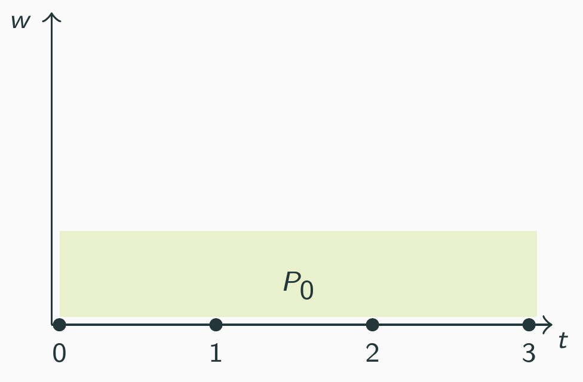
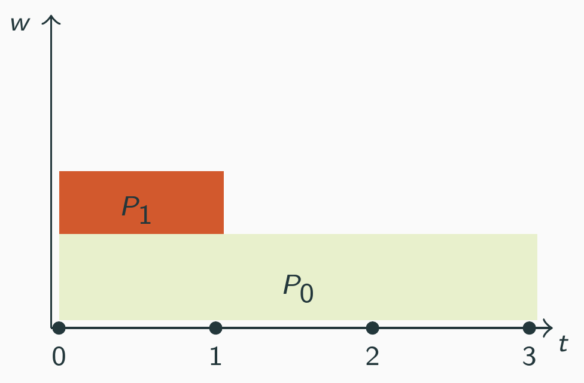

# Ecole d'été Green IT 2024 - Expérimentations sur les sondes énergétiques logicielles 

Travaux pratiques visant à mettre en avant les limitations inhérentes des sondes énergétiques logicielles / modèles énergétiques par répartition.

Instructeurs : 
- Emile CADOREL - Ingénieur R&D 
- Dimitri SAINGRE - Ingénieur R&D

Objectifs de la session : 
- Déployer Scaphandre et comprendre son fonctionnement 
- Effectuer des tests de montée en charge 
- Comprendre et mettre en avant les limitations de ces modèles par répartition

## Préparation de l'environnement 
Cette session pratique va se dérouler sur un cluster Nantais de Grid5000 : ecotype. Nous allons dans un premier temps préparer notre environnement technique. 

### Accès sur Grid5000
Les accès aux noeuds Grid5000 se font principalement via SSH. 

Si vous pouvez/voulez vous connecter via un shell local :
1. Se connecter à Grid5000 via `ssh login@access.grid5000.fr`
2. Se connecter au site de Nantes via `ssh nantes`

Si vous préférez éviter d'utiliser un shell local :
1. Vous pouvez accéder à un shell via votre navigateur web à l'adresse suivante : https://intranet.grid5000.fr/shell/nantes/

Génération d'une clé SSH pour pouvoir vous connecter sur un serveur `ssh-keygen -t rsa -b 4096 -C "foo@bar.com"`

Réservation d'un serveur : `oarsub -r now -t inner=258103 -l walltime=2:00 -t deploy`

Récupération de l'identifiant ("Job id") de réservation `oarstat -u`

Déploiement de l'OS : `sh deploy.sh JOB_ID` (en remplaçant JOB_ID par l'identifiant de job récupéré juste avant)

## Partie 1 - Utilisation de Scaphandre
Par simplicité, nous allons utiliser les fonctions stress comme applications à mesurer durant ce TP. 
Ces applications, en plus d'être facile à lancer, conduisent à une consommation de ressource très stables et peuvent être configurées pour consommer une 
quantité de ressources données. 

**Note :** Stress est une suite d'applications permettant d'effectuer des tests de montée en charge configurables sur différents composants d'un serveur (CPU, mémoire, 
IO, ...). 

Scaphandre peut s'utiliser de plusieurs façons : 
- En mode "ligne de commande" : en sélectionnant une sortie `stdout`, Scaphandre affiche la consommation estimée des 15 processus les plus consommateurs
- En mode "script" : en sélectionnant la sortie `json`, Scaphandre écrit ses estimations dans un fichier de sortie au format JSON. 
- En mode "export" : Scaphandre peut exporter ses résultats vers un composant tier comme Prometheus. Un fichier docker-compose est proposé dans le répertoire
Github du projet pour déployer facilement un Dashboard Scaphandre. 

### Tâche 1.1 - Puissance sur un coeur CPU
Dans un premier temps, nous allons découvrir Scaphandre en le testant sur diverses fonctions stress. 

Exemple de fonctions de stress utilisable pour charger le CPU: 
- Des algorithmes: ackermann, queens, fibonnacci, matrixprod
- Des stress d'instructions mathématiques specifiques : float64, int64, decimal64, double
- Génération de nombres pseudo-aléatoires : rand
- Des stress d'instructions de conversion : int64float, int64double

**Objectifs** : À la main, en lançant diverses fonctions stress sur un même nombre de coeurs CPU, voyez-vous une différence de consommation ? 
Lister quelques exemples de commandes stress et leur coût associé en Watts.

**Notes** : Vous pouvez trouver la liste des fonctions proposées par stress via
la commande `stress-ng --cpu-method which`. Pour lancer un stress sur un nombre
de coeur donnée : `stress-ng -c ${nb_cores} --cpu-method ${func} -t
${duration_in_sec}`

### Tâche 1.2 - Puissance sur plusieurs coeurs CPU 
Nous allons maintenant évaluer la consommation d'un même stress sur plusieurs coeurs. Pour charger N coeurs, stress lance N instances de l'application 
demandée. Il s'agit donc du même programme, lancé N fois. Pour un stress donné, évaluer sa consommation quand il est lancé sur 1 coeur, puis plusieurs. 

**Objectifs**: À la main, lancer 1 à N stress et observer la consommation (en puissance) assigné au différent applications.
Qu'observez-vous vis à vis de l'évolution de la consommation de chaque stress par rapport à l'augmentation de la charge serveur ?

Pouvez-vous automatiser une telle expérimentation en Python (à partir du script T1.2/main.py) ? Reproduisez l'expérimentation sur plusieurs opérations de stress différentes. 

Afficher les courbes de consommations de puissance des différent scénario, ainsi que la puissance associé au processus en fonction du nombre de coeurs utilisé sur la machine.

Des utilitaires comme `htop` sont très pratique pour étudier la consommation de ressources de notre serveur en temps réel. Etudier la consommation énergétique de nos 
différents stress en comparaison de leur consommation CPU. Que pourriez-vous en déduire entre le lien entre pourcentage d'utilisation CPU et consommation énergétique ?
Plus précisément, la consommation énergétique est-elle directement liée au pourcentage d'utilisation CPU ? 

**Notes :** Pour faciliter la récupération de la consommation des différents
stress lancé, il est conseillé de les executer dans des *cgroups*. Les cgroups
sont une fonctionnalité de Linux permettant de lancer plusieurs processus dans
des groupes logiques. Les cgroups sont à l'origine utilisés pour monitorer ou
contraindre les ressources (CPU, mémoire...) associsées à divers groupes de
processus. Nous les utiliserons ici pour faciliter la récupération des PIDs des
stress lancés.

Quelques commandes pour manipuler les cgroups :
- Créer un cgroup : `cgcreate -g cpu:/MONCGROUP`
- Lancer un stress dans un cgroup : `cgexec -g cpu:/MONCGROUP stress -c 1`
- Afficher les PIDs des processus lancés dans notre cgroup : `cat /sys/fs/cgroup/MONCGROUP/cgroup.procs`

### Tâche 1.3 - Puissance sur plusieurs programmes en parallèle
Nous avons commencé à voir qu'un même programme peut induire une consommation différente selon son contexte d'execution. Nous allons illustrer cela un peu plus en étudiant la 
consommation d'un stress selon qu'il est lancé seul ou en parallèle d'autres stress. Le scénario d'expérimentation est le suivant. 

1) Lancer un premier stress et étudier sa consommation énergétique. 

2) Lancer un second stress en parallèle du premier. 

**Objectifs** : En partant du script T1.3/main.py, écrivez un script permettant de lancer une application de stress utilisant plusieurs coeurs CPU. 
Compléter ce script pour qu'il joue un scénario d'applications injectant du "bruit". Un exemple de scénario est présenté dans T1.3/scenario.json.

Qu'observez-vous vis à vis du profil de consommation du premier stress ? (en jouant plusieurs scénario de bruit).
Pour rappel, les stress ont des comportements très stables (facilement verifiable en lançant l'application seule). 
Retrouve-t-on ce comportement lorsque du "bruit" est généré en parallèle de notre stress ? (notemment en utilisant uniquement les coeurs physique pour limiter la contention ?)

***Note**: Dans des environnements Cloud, les services numériques déployés par les utilisateurs sont bien souvent mutualisés sur un nombre réduit de serveurs. 
Un utilisateur n'a donc pas de vision sur l'état du serveur sur lequel il est déployé : ses spécifications et l'évolution de sa charge due aux autres 
utilisateurs. De ce que vous observez sur ces expérimentations, que pouvez-vous dire des estimations de consommations fournies par ces sondes logicielles 
dans ces environnements Cloud ? 

### Tâche 1.4 - Consommation énergétique d'un stress
Nous nous sommes intéressés ici qu'à la puissance estimée d'un stress selon son contexte d'execution. Nous avons vu notamment qu'elle diminue 
en fontion du nombre de stress lancé. Qu'en est-il de sa consommation énergétique ?

**Note :** Pour rappel, la consommation énergétique en Joules correspond à l'integrale de la puissance (en Watts). Comme nous faisons un mesure de puissance par seconde, calculer l'énergie est simple, on fait la somme. 

A partir d'une certaine charge, une contention sur les ressources serveurs
commence à apparaitre (surtout quand on commence à utiliser les coeurs
logiques). Cette contention emmene à une augmentation du temps d'execution.
Cette augmentation compense-t-elle la réduction du coût énergétique à haute
charge ?

**Objectifs:** Il est possible de configurer stress pour lancer un nombre défini d'opérations, garantissant une même quantité de travail. En vous basant sur 
le script développé pendant la tâche 1.2, dressez la courbe de la consommation énergétique (en joules) d'un stress en fonction du nombre de coeurs chargés. 
Observez-vous toujours une réduction de la consommation avec l'augmentation de la charge serveur ? 

En reprenant le script développé dans la tâche 1.3, calculer la consommation d'énergie de l'application "baseline". 
En jouant différent scénario, observer la consommation d'énergie de l'application "baseline", est elle stable ?

**Questions**: 
Que peut on en déduire quand à notre capacité à trier les applications par leur consommation d'énergie ?
Comment peut on définir la "Consommation énergétique d'un logiciel" ?

## Partie 2 - Comprendre la consommation énergétique d'un serveur
Nous avons vu dans la première partie que la consommation énergétique d'un programme (ici *stress*) fluctue en fonction de son environnement d'execution. 
Nous allons dans cette partie essayer de comprendre un peu mieux pourquoi.

### Tâche 2.1 - Profil de consommation d'un serveur 
Nous avons vu dans la tâche 1.2 qu'un même stress ne consommait pas autant d'énergie selon s'il était lancé sur un ou plusieurs coeurs en parallèle. Nous voulons
ici étudier l'évolution de la courbe de consommation de notre serveur en fonction du nombre de coeurs chargés par un stress. Nous nous intéresserons ici à la 
consommation globale du host, pas à la consommation individuelle estimée de chaque programme. 

**Objectifs**: En reprenant les script développé dans la tâche 1.4, afficher la courbe de consommation de l'hote en fonction de sa charge. 
Comment charactériser la courbe de consommation de ce serveur ? Quel impact aura cette courbe de consommation sur le coût d'une application, selon 
qu'elle soit executée sur un serveur à vide ou un serveur déjà remplis ? 

Reproduire la construction de ce profil via différentes applications de stress (ex: sqrt, ackermann, fibonnacci, matrixprod, etc.).
Qu'observez-vous ? Qu'en déduisez-vous sur la relation entre charge CPU et consommation énergétique ? 

### Tâche 2.2 - Impact de Turbo boost et hyperthreading sur la consommation énergétique
Les processeurs modernes embarque plusieurs fonctionnalités permettant d'optimiser leurs performances et leur consommation énergétique en fonction de leurs besoins. 
Nous allons étudier l'impact de deux de ces fonctionnalités sur le profil de consommation énergétique d'un serveur : turbo boost et hyperthreading. 

Pour rappel : 
- Turbo boost permets d'ajuster dynamiquement la fréquence des coeurs du processeur en fonction des besoins de calculs 
- Hyperthreading permets de faire fonctionner plusieurs threads en parallèle sur un même coeur (via un mécanisme de "coeurs virtuels")

Par défault ces deux mécanismes sont activés sur Grid5000. C'est en effet le type de configuration que l'on trouve activé par défault sur les serveurs car ils 
ont un intérêt significatif sur leurs performances. Nous allons nous intéresser ici à leur impact sur la courbe de consommation d'un serveur. 

Grid5000 permets d'activer et désactiver dynamiquement ces fonctionnalités. Vous trouverez comment faire dans la documentation présente ici : https://www.grid5000.fr/w/CPU_parameters#Setting_CPU_parameters:_Hyperthreading,_C-State,_P-State_and_Turboboost

Essayez de reproduire la construction du profil de consommation énergétique du serveur (Tâche 2.1) en désactivant hyperthreading et turbo boost. Qu'observez-vous ? 
Quelle est la différence entre la courbe que vous observez ici et celle que vous avez obtenu lors de la tâche 2.1 ? 
